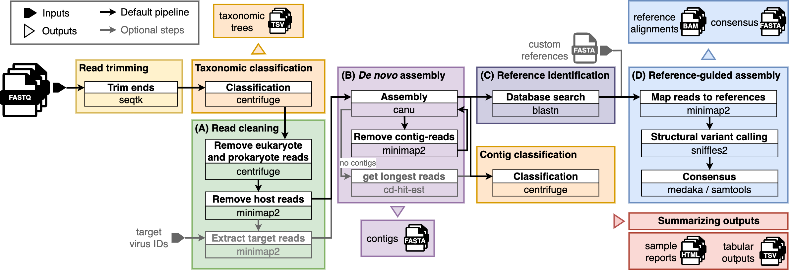

# ViMOP
[](ViMOP_logo.png)
Analysis pipeline for virus metagenomics using nanopore sequencing.

This pipeline is developed by the [Outbreak Preparedness and Response team](https://www.bnitm.de/forschung/forschungsgruppen/pathogen/abt-virologie/laborgruppe-duraffour-pahlmann/team) at the Bernhard Nocht Institute for Tropical Medicine.
It is used to analyse nanopore reads from untargeted sequencing of viruses such as Lassa, Ebola or Dengue at various sites.

If you have questions, suggestions, want to contribute or have a specific requirement (e.g. for the license) please feel free to contact us.

## Purpose and limitions

The main purpose of this pipeline is the assembly of virus genomes in metagenomics samples.
We have created a reference database with our favourite viruses. However, you can also create your own.
For information on databases read further down.
If you need assistance for setting up a reference data set, please contact us.

The pipeline automatically finds well fitting virus genomes and uses them as references to build reference based consensus genomes.
To build a consensus, [Sniffles](https://github.com/fritzsedlazeck/Sniffles) and [samtools consensus](https://www.htslib.org/) or [medaka](https://github.com/nanoporetech/medaka) are used.
This works well for small and medium size RNA viruses such as Lassa, Dengue, Ebola and many others.
However, for large DNA viruses with repetetive regions, such as mpox, this approach may not correctly generate complete genomes.
In any case, we recommend carefully reviewing your output (e.g. the alignment .bam files).

## Prerequisites

This pipeline runs best on a powerful laptop or PC. We recommend at least 30 GB RAM and 16 CPUs. Depending on your data set, the pipeline may also work on lower ressources. You can change the parameters `--min_cpus`, `--min_ram`, `--min_disk_space_work_gb` and `--min_disk_space_out_gb` and the pipeline will run with less. However, this may or may not work, and it may take much longer, as some tools like Canu need quite some ressources. 

You can run and install the pipeline from the command line using [nextflow](https://www.nextflow.io/) or from the [EPI2ME desktop](https://nanoporetech.com/software/other/epi2me-desktop-application) application from ONT.
If you are using EPI2ME desktop, nextflow and docker are included in the setup of the software. Else you need to install nextflow and [docker](https://www.docker.com/).

## Installation and operation

You can install this pipeline by cloning this repository, running nextflow or using EPI2ME desktop.
In any case, you need a reference database installed.
The pipeline will automatically install all dependencies during the first run using docker, given that you computer is connected to the internet.
After the set up of the reference database and the dependencies, the pipeline does not require an internet connection. 

### Using the command line

To run the pipeline from the command line, make sure to have nextflow and docker installed.
If you cloned this repository, change into its root directory and run `nextflow main.nf` with the additional options.
Without manually cloning the repository you can simply run `nextflow run OPR-group-BNITM/vimop` plus options.
We will stick to the latter now.
Type `nextflow run OPR-group-BNITM/vimop --download_db_all` to install our latest database release.
There is a lot to download, so please be patient.
If the pipeline fails during the process (which may happen due to instable network access), use the `-resume` option to
continue your download without having to restart again.
You can also separate the download of the reference data into three parts by running the pipeline three times using the options `--download_db_virus`, `--download_db_contamination` and `--download_db_centrifuge` in separate runs. We would recommend this.
If you want to replace an existing database with our latest version, add the option `--download_db_update_existing`.

To finally run an analysis type `nextflow run OPR-group-BNITM/vimop --fastq /path/to/fastqfiles --out_dir /path/for/your/output`.
You can get some demo data here: [ViMOP-demo](https://opr.bnitm.de/example_data/vimop-demo.tar.gz). Once you downloaded and unzipped this folder, use the path to the "lasv_simulated" directory as fastq input of the command above.

### Using EPI2ME desktop

Open the application and enter the github url of this repository under Launch -> Import workflow -> Import from Github.
Once you added the workflow, launch it and go to the `Setup` options section.
You can chose to either download all three parts of the database or donwload contaminants, virus references and centrifuge index separately by ticking the respective boxes.
Launching the process will download and install the database into your home directory.
This will probably take a while.

If you want to update your existing database to our latest version, check the respective box to overwrite your existing files.
This will only be done, if something in the respective database has changed.

Afterwards you can launch the pipeline to analyse data.
You can also click "run demo analysis".

## Workflow

In the following, the most important steps of the pipelines are explained with the respective options to set.

### Input

A directory with fastq files is passed to `--fastq`.
The directory can contain subdirectories called barcode01, barcode02, ... 
In this case, the different barcodes are treated as different samples with separate output produced for each.

### Read trimming

At the beginning the pipeline trims the ends of the reads to remove adapter sequences and primers.
`--trim_length` sets the number of bases trimmed from both ends.

### Read classification and optional removal of non-viral reads

Centrifuge is used to classify the reads.
This helps to get an overview of how your metagenomics sample is composed.
Centrifuge also classifies the contigs (see later) to get a rough idea about contigs that do not match anything in the reference database or only partially. 
Use `--centrifuge_do_classify false` to deactivate all centrifuge classifications and save time.

Additionally, you can use the centrifuge classifications to remove reads (not contigs) that are non-viral to a given degree of confidence.
Activate this with `--centrifuge_do_filter true` and use `--centrifuge_filter_min_score 150` to set the minimum level of confidence (e.g. 150 in our example).
The pipeline will remove all reads that are classified to anything that is not viral with at least this score.
Use this if you have a lot of different contaminations that you want to remove such as bacterial reads from a fecal sample.
But beware that centrifuge is limited in it's accuracy and you may also remove some false positives.

### Host and contaminant removal

Host and contaminant reads are removed by mapping them against reference sequences and extracting those that map.
The database config file (contamination.yaml) defines the reference sets and the key values assigned to them.
Use the option `--contamination_filters "reagent,mouse"` for example to remove mouse and reagent reads (the default is humand reads).
The following filters are included in our database

| Filter        | File Name                                               |
|---------------|---------------------------------------------------------|
| reagent       | reagent-db.fasta.gz                                     |
| human_rna     | GCF_000001405.39_GRCh38.p13_rna.fna.gz                  |
| human_dna     | GCF_000001405.39_GRCh38.p13_genomic.fna.gz              |
| mouse         | GCA_000001635.8_GRCm38.p6_genomic.fna.gz                |
| mastomys      | GCF_008632895.1_UCSF_Mcou_1_genomic.fna.gz              |
| aedes_aegypti | GCF_002204515.2_AaegL5.0_genomic.fna.gz                 |

### Virus read enrichment

One can also filter for specific species or groups of viruses.
Only reads that map to the given targets are then used in the following assembly step.
An arbitrary number of filters can be used.
The filters themselves are part of the reference database and the respective names defined in the database configs.
This command `--targets "MARV,EBOV,FILO"` would activate filters for Marburg virus, Ebola and the Filo-virus family.

In our default database there are filters for individual virus species and for virus families.
They are listed in the following:

| Virus                                           | Abbreviation | TaxId     |
| ----------------------------------------------- | ------------ | --------- |
| Emesvirus zinderi                               | MS2          | 329852    |
| Mammarenavirus lassense                         | LASV         | 3052310   |
| Mammarenavirus choriomeningitidis               | LCMV         | 305230    |
| Mammarenavirus juninense                        | JUNV         | 2169991   |
| Orthoebolavirus                                 | EBOV         | 3044781   |
| Orthoflavivirus denguei                         | DENV         | 3052464   |
| Orthoflavivirus zikaense                        | ZIKA         | 3048459   |
| Orthomarburgvirus                               | MARV         | 3044783   |
| Orthonairovirus hazaraense                      | HAZV         | 3052519   |
| Severe acute respiratory syndrome coronavirus 2 | COVID        | 2697049   |
| West nile virus                                 | WNV          | 3048448   |
| Yellow fever virus                              | YFV          | 3046277   |

| Virus family            | Abbreviation | TaxId     |
| ----------------------- | ------------ | --------- |
| All                     | ALL          | 10239     |
| Arenaviridae            | ARENA        | 11617     |
| Filoviridae             | FILO         | 11266     |
| Hantaviridae            | HANTA        | 1980413   |
| Nairoviridae            | NAIRO        | 1980415   |

### Assembly

An assembly is run for each of the filtered read sets (explained in the previous section) and for the read set with no target filter.
To disable running the no target filter set `--assemble_notarget false`.

After the initial assembly, an iterative re-assembly procedure is run (unless deactivated with `--reassemble_max_iter 0`).
The purpose is to also find virus segments, that are present in very low concentration.
All reads are mapped to the contigs and those that map are removed.
The remaining reads get assembled once more.
This procedure is repeated until a maximum number of cycles is reached, no reads are left after filtering or no contigs are produced by the canu assembly.

For read sets that were filtered to a target (see previous section), there is a special procedure if no contigs were assembled.
In this case, the longest X reads (set with `--nocontigs_max_reads_precluster`) are passed to a clustering by cd-hit-est.
Of these clusters, the longest Y reads (set with `--nocontigs_nreads`) are chosen instead of contigs for the following target search.
Canu-corrected reads are used for this if available, else the raw reads.

A number of parameters for the canu assembler can be set, that determine how many reads are used and corrected for assembly. See options.

### Target search

Each contig is used to for a BLAST search in the virus reference database.
The highest scoring hit is then used as a reference genome.

### Consensus creation

Reads are mapped against the reference genome.
The mapping parameters can be changed (see options).
There are multiple options to generate the consensus.
The default option is to choose automatically from samtools consensus and medaka.
If medaka finds a model for you data, medaka is used, else samtools.
Samtools consensus takes the most abundant base and masks all positions with too little coverage or unclear signals below the given threshold.
Medaka 
You can also directly choose medaka (medaka) or samtools (simple).

For medaka you can pass a model name for the option `medaka_consensus_model`.
Chosing auto will let medaka chose the model, which is the default.
However, if medaka does not find a model fitting your data, medaka (if explicitely chosen) will use the medaka default model, which may not be optiomal.

## Options

To get a list of all available options type `nextflow main.nf --help`.

## Output and report

The output is structured like this:

```
output
├── nf-report.html
├── params.json
└── barcode01
    ├── report_barcode01.html
    ├── classification
    │   ├── classification.html
    │   ├── classification.tsv
    │   ├── classification_kraken.tsv
    │   └── classification_report.tsv
    ├── consensus
    │   ├── AB627954.consensus.fasta
    │   ├── AB627954.depth.txt
    │   ├── AB627954.reads.bam
    │   ├── AB627954.reads.bam.bai
    │   ├── AB627954.reference.fasta
    │   ├── AB627954.variants.vcf.gz
    │   ├── CS272305.consensus.fasta
    │   ├── CS272305.depth.txt
    │   ├── CS272305.reads.bam
    │   ├── CS272305.reads.bam.bai
    │   ├── CS272305.reference.fasta
    │   └── CS272305.variants.vcf.gz
    ├── tables
    │   ├── consensus.tsv
    │   ├── contigs.tsv
    │   └── reads.tsv
    ├── assembly
    │   ├── no-target.contigs.fasta
    │   └── re-assembly.contigs.fasta
    └── selected_consensus
        ├── LCMV_L.fasta
        └── LCMV_S.fasta
```

nf-report.html contains technical information about the run and ressource usage.
For each sample there is a directory with results (here barcode01).
The summary of the results is found in report_samplename.html.
Tables contains the information from the htmml report in .tsv files.
The classification directory contains all files for the centrifuge read classification.
The directory consensus contains consensus genome sequences, alignment files and variants as well as the chosen reference.
The chosen selected genomes for curated virus species are listed in selected_consensus with a separate file for each segment.
Contigs can be found in the fasta files in the assembly directory.

## Database

ViMOP relies on a reference database structure.
It is usually placed in your home directory in a folder called `ViMOP_DB`.
I has the following structure:

```
ViMOP_DB/
├── centrifuge/
├── contaminants/
└── virus/
```

The three subdirectories contain files for centrifuge classification, contaminants/host read removal and the virus reference sequences.
Each directory contains a file with a yaml file with the same name prefix (e.g. centrifuge.yaml, contaminants.yaml, virus.yaml).
The configs hold the relefant information about the database parts as well as an entry 'version' with a version number and an entry description with a brief 'description'.

The three database parts are briefly described in the following.

### centrifuge

The centrifuge config looks like this

```yaml
version: 1.0
description: "Refseq reference genomes plus genbank virus sequences"
index_name: all
files:
- all.1.cf
- all.2.cf
- all.3.cf
- all.4.cf
virus_taxid_file: virus_taxids.txt
```

The index name has to be the prefix of the centrifuge index which are the files listed under files.
These files need to be in the centrifuge DB directory.
The virus_taxid_file contains all virus taxids.
This information is important for the centrifuge based filtering.
In addition to unclassified reads, reads classified to these Tax-IDs will be kept since they are considered to be virus reads.
Version and description are for display in the report.

### contaminants

This directory holds files with sequences of host or reagents.
The respective config file looks like this

```yaml
filters:
  reagent: "reagent-db.fasta.gz"
  human_rna: "GCF_000001405.39_GRCh38.p13_rna.fna.gz"
  human_dna: "GCF_000001405.39_GRCh38.p13_genomic.fna.gz"
  mouse: "GCA_000001635.8_GRCm38.p6_genomic.fna.gz"
  mastomys: "GCF_008632895.1_UCSF_Mcou_1_genomic.fna.gz"
version: 1.0
description: "Human (GRCh38), mouse (8_GRCm38), mastomys and contaminant filter set"
```

The keys are used to choose the filters using the command `--contamination_filters`.

### virus

The virus database contains virus reference sequences.
It consists of a config file, a set of sequence files and a blast database.
Let's have a look at a small example.
Our directory content could look like this

```
ViMOP_BUCKET/
├── db.yaml
├── ALL.fasta
├── EBOV.fasta
├── LASV.fasta
├── FILO.fasta
└── blast_db/
    ├── ALL.nhr
    ├── ALL.ndb
    ├── ALL.nin
    ├── ALL.njs
    ├── ALL.nog
    ├── ALL.not
    ├── ALL.nos
    ├── ALL.nsq
    ├── ALL.ntf
    └── ALL.nto
```

And the corresponding config could look like this:

```
all:
  blast_db: blast_db
  blast_prefix: ALL
  fasta: ALL.fasta
curated:
  LASV:
    fasta: LASV.fasta
    name: Mammarenavirus lassense
    organisms:
    - Lassa virus GA391
    - Lassa virus Josiah
    - Mammarenavirus lassaense
    segments:
    - S
    - L
  EBOV:
    fasta: EBOV.fasta
    name: Orthoebolavirus
    organisms:
    - Orthoebolavirus bombaliense
    - Orthoebolavirus bundibugyoense
    - Orthoebolavirus restonense
    - Orthoebolavirus sudanense
    - Orthoebolavirus taiense
    - Orthoebolavirus zairense
    segments:
    - Unsegmented
filters:
  FILO: FILO.fasta
version: 1.0
description: "A database that has Lassa and Ebolavirus curated."
params.fasta_sequences: /data/home/nils.petersen/dev/VirusDatasetCuration/workflow/testset/testset.fasta
params.taxa_config: /data/home/nils.petersen/dev/VirusDatasetCuration/workflow/testset/test_groups_refs_and_organisms.yaml
params.filter_max_n_share: 0.01
params.filter_min_relative_length: 0.8
params.cdhit_threshold: 0.98
```

ALL.fasta contains all sequences.
EBOV.fasta contains ebola virus sequences, LASV Lassa virus and FILO filo virus seqeunces.
These are the files that are used as mapping filters.
The file ALL.fasta is also used to create the blast database.
Our blast database is build with the blast version used in the pipeline (see `images/general/general.yaml` in this repository).
The curated viruses will be shown in their own sections in the report and have segment wise one fasta file, where the consensus sequence with the highest recovery is chosen.
All other virus targets are added in ALL and 

The headers in the fasta files have to be formatted like in this example

```
>OQ791477.1 |MAG: Lassa mammarenavirus isolate c0212 segment L genomic sequence|Arenaviridae|Mammarenavirus lassaense|forward|L
CAAAATGGGCAACAAGCAAGCCAAGTCAACCAAAGTCGATGAACAACATAGAGCTCAT...
```

Separated with a "|" we have
- genbank ID
- description
- family
- species name
- orientation of the sequence with respect to the original database entry. We re-oriented sequences so that all sequences of a curated data set have the same orientation. However, this can also simply be set to "Unkown".
- the segment name. Set to "Unknown" for non-curated sequences. For curated sets (e.g. in our example LASV and EBOV) this needs to be assigned. If there is only one segment, use "Unsegmented". The segments also need to be listed in the config file.

## Acknowledgements

This product includes software developed by Oxford Nanopore Technologies Plc.
