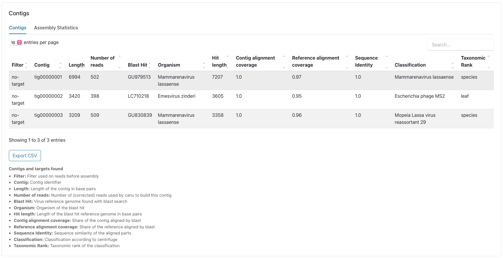
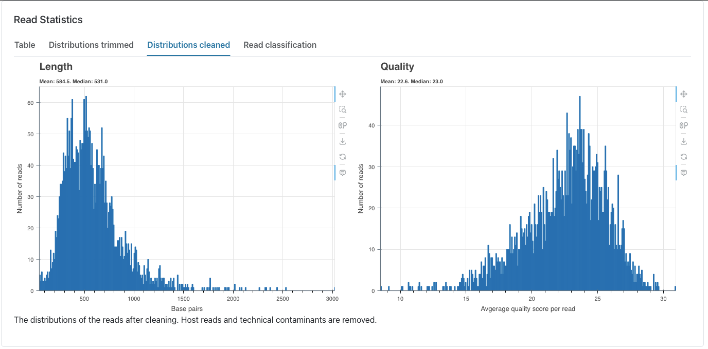

# Example output interpretation
After completing the installation tutorial, you will end up with a [report file](https://opr.bnitm.de/example_data/report_example_data.html) and the output files. Feel free to explore our example report through the previously provided link.

## Read Statistics
The first thing you will see are the read statistics. This includes the length distribtions before and after trimming and filtering as well as the amount of reads that were filtered out based on the centrifuge classification (see 'read classification' tab) and the mapping onto the host genome and the reagent database.  

## Consensus
This section reports the main output of the pipeline. Here the virus species and the coverage of the generated consensus sequence is reported. We have a curated subset of viruses relevant to our projects. If these viruses are found in our samples, these viruses show up in the report in a separate tab. In our demo report for example we have both LASV segments. All other viruses will show up in the Non-curated or All tab.     

## Contigs
In the next section you will see the assembly results provided by canu. You can also see the Blast hit of each contig that was used to create the consensus sequence. Additionally, in this report you can see the centrifuge classification of each contig. You can check if there is any discrepancies between the BLAST and centrifuge classification, since the blast search only includes viruses you can check for false positives here.

