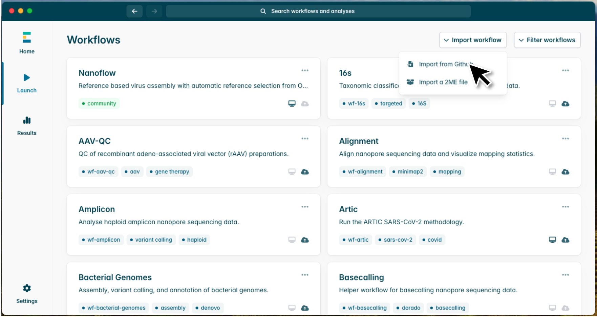
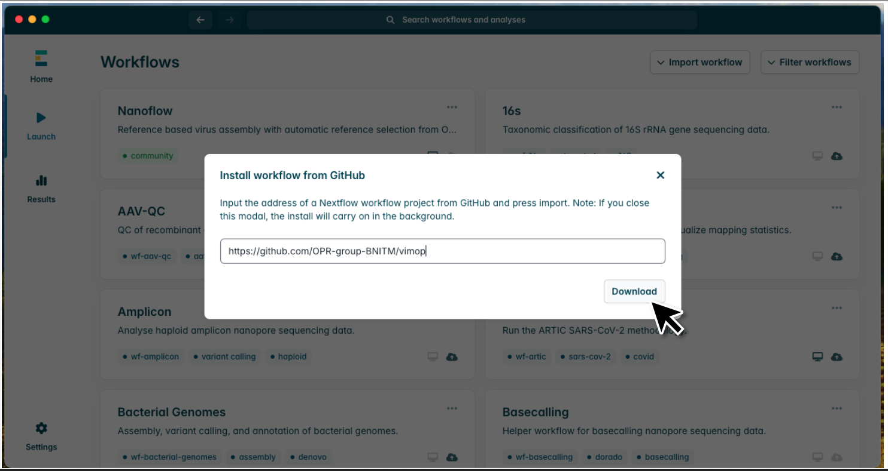

# ViMOP installation

This tutorial describes multiple ways how to install ViMOP on your Linux or MacOS system.

# Prerequisites

ViMOP uses epi2me, nextflow and docker. All of these dependencies can be installed with and without the usage of the command line depending on the user's preference.

## Docker installation
### Install Docker Desktop 
If you do not have the Docker engine already installed in your system, you can install it bundled together with Docker Desktop. In MacOS and Windows the installation of Docker Desktop works completely without the command line. Download the Docker Desktop installer according to your operating system on the bottom of this [Docker docs page](https://docs.docker.com/desktop/) and follow the instructions after opening the installer.

### Install Docker Engine
For Linux we recommend the installation of the Docker engine. You can find a detailed installation manual in the [Docker docs](https://docs.docker.com/engine/install/). After following the steps on that web page, you should make Docker managable as non-root user. For this, follow the steps on this website: [Manage Docker as non-root user](https://docs.docker.com/engine/install/linux-postinstall/). You may need to restart your Laptop so that Docker shows up as installed in your system.

## EPI2ME installation
To use ViMOP in the graphical user interface you need to install Oxford Nanopore's EPI2ME Desktop application. If you only want to use ViMOP as command line tool you can skip this step.
Download the installer according to your operating system from the [EPI2ME website](https://epi2me.nanoporetech.com/downloads/). At the time of this tutorial the most recent version of EPI2ME Desktop is version 5.2.5. Follow the installation instructions after opening the downloaded file, for Ubuntu/Debian you need to open the file with the software center. EPI2ME also provides an [installation guide](https://epi2me.nanoporetech.com/epi2me-docs/installation/#installation-on-linux) for all operating systems.  
  
After opening the application, you will be prompted to sign in. However, you can just continue as guest. Sometimes that option is hidden, but you can find it by clicking on the three dots at the bottom  



## Nextflow installation
If you installed EPI2ME you can install nextflow via the EPI2ME interface by going to Settings->Local->System setup->Nextflow->setup. This setup will also make sure you have the correct java version installed  
If you want to install nextflow via the command line there are two options:
1. Follow the installation instructions from the [nextflow documentation](https://nextflow.io/docs/latest/install.html#install-page)
2. Or, if you have conda installed and prefer to have your nextflow installation separate from the rest of your home environment, you can create a conda environment and install nextflow in there:


```python
bash conda create -n nextflow nextflow
conda activate nextflow
```

# Installing and setting up ViMOP

# Installation and setup of ViMOP
If you have nextflow and docker installed in your system you are good to go to setup and then run ViMOP via the command line or EPI2ME! 

## EPI2ME

### Setup
You can set up ViMOP fully via the EPI2ME interface
1. Import ViMOP from GitHub  
  
 
 
2. Paste the URL to our GitHub repository into the interface ```https://github.com/OPR-group-BNITM/vimop``` and click Download  
  

 
3. Open workflow  
  

 
4. Launch the workflow  
  

 
5. Open the setup menu  
  

 
6. Select to download all databases. If you want to update an already existing database you have downloaded from us, you need to select to overwrite the existing databases as well.  
  

 
7. Launch the workflow.  
  

 
The download will now take a while depending on your network connection. Please be patient.

### Demo run
To test the functionality of ViMOP you can select to run a demo run with a simulated Lassa virus here.  
  


### User defined input
If you want to run ViMOP with your own fastqs, you can select your input in the first input menu of the interface. You can select either a fastq or fastq.gz file or a directory that contains subdirectories of the different barcodes that contain the fastq or fastq.gz files.  

1. Select FASTQ  
  

 
2. Optionally, you can, modify the pipeline parameters in the menu on the left. For example under Nextflow configuration you can name your sequencing run.  
  
  

3. Then click on Launch workflow.

## Command line Usage
Without installing EPI2ME, ViMOP can be setup through the command line.

### Quick start

If you want to run the pipeline without cloning our git repository you can just run
1. Setup database


```python
nextflow run OPR-group-BNITM/vimop --download_db_all
```


2. Run the pipeline with your own fastq and optionally your own configuration. To configure your run you can download the nextflow.config in our GitHub repository and edit the parameters as needed.


To test the pipeline you can get some demo data [here](https://opr.bnitm.de/example_data/lasv_simulated_run.fastq)


```python
nextflow run OPR-group-BNITM/vimop --fastq /path/to/fastqfiles --out_dir /path/for/your/output [optional: -c /path/to/nextflow.config]
```

### Installation through GitHub repository
Alternatively you can clone our GitHub repository to customize the nextflow.config that the pipeline will use by default yourself.  

1. Open the command line 
2. Clone the repository


```python
git clone https://github.com/OPR-group-BNITM/vimop.git
```


3. Setup the database


```python
cd vimop
nextflow run main.nf --download_db_all
```


If you want to replace an existing database with our latest version, add the option --download_db_update_existing  

4. Run the pipeline


```python
nextflow run main.nf  --fastq /path/to/fastqfiles --out_dir /path/for/your/output
```
