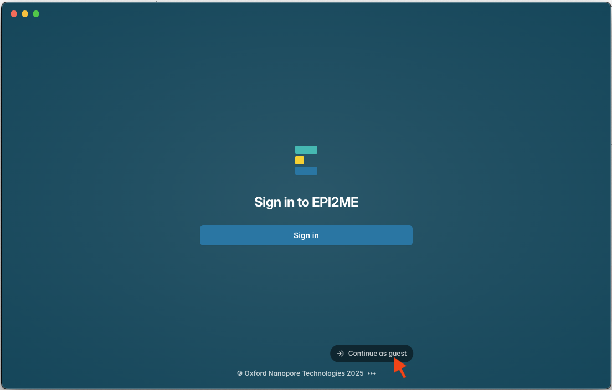
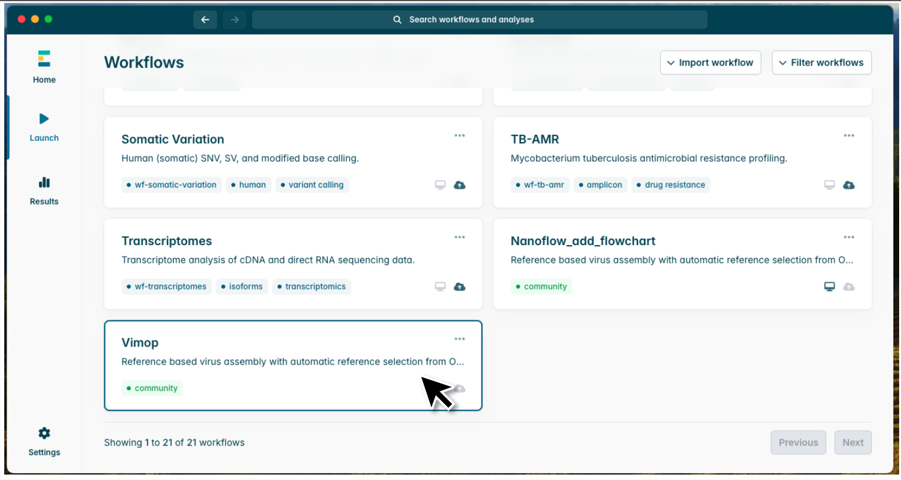
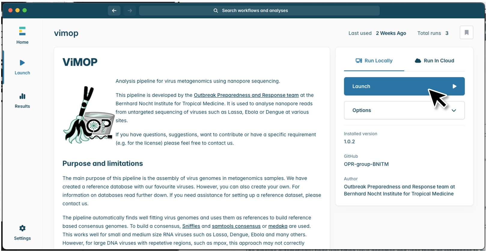
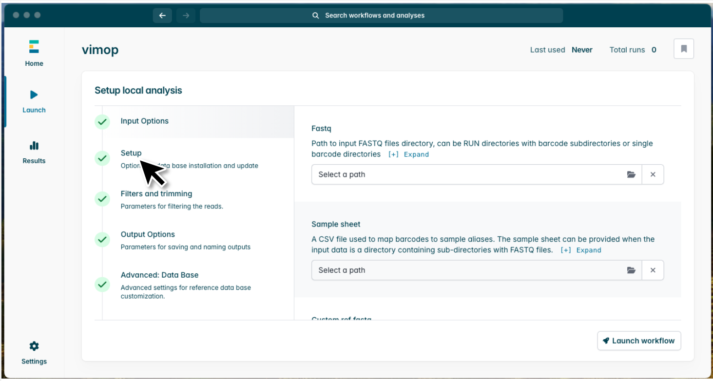
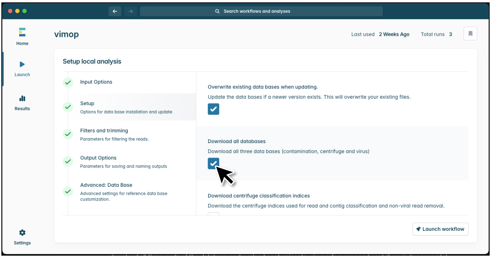
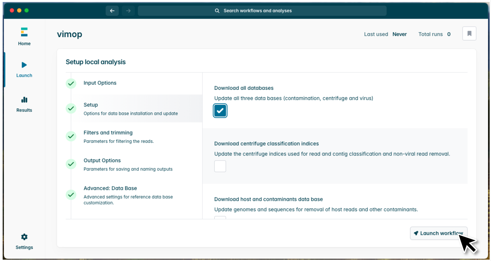
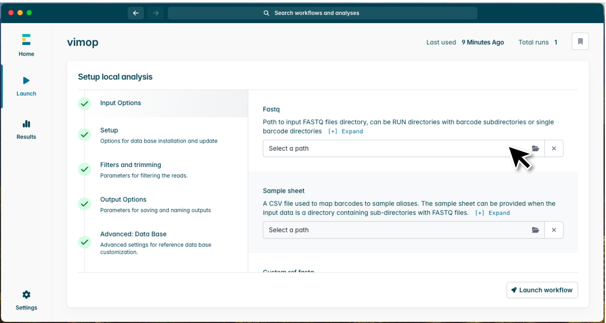
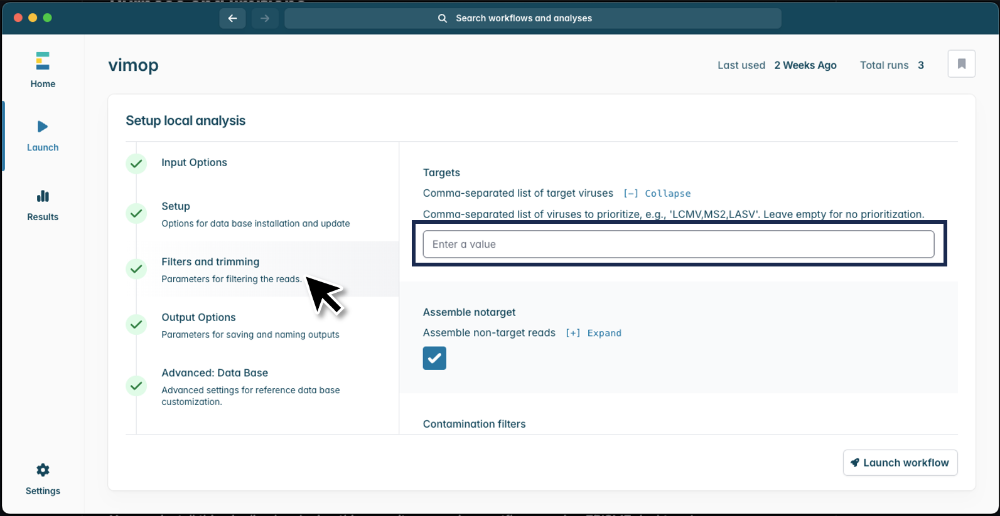

# ViMOP with EPI2ME

This tutorial describes how to install Docker, Nextflow, EPI2ME and then ViMOP via the graphical user interface of EPI2ME.

# Table of Contents

- [ViMOP with EPI2ME](#vimop-with-epi2me)
  - [Prerequisites](#prerequisites)
    - [Docker installation](#docker-installation)
    - [EPI2ME installation](#epi2me-installation)
    - [Nextflow installation via EPI2ME](#nextflow-installation-via-epi2me)
  - [Installation and setup of ViMOP](#installation-and-setup-of-vimop)
    - [Install workflow](#install-workflow)
    - [Set up the data base](#set-up-the-data-base)
    - [Demo run](#demo-run)
    - [User defined input](#user-defined-input)
  - [Accessing ViMOP via the command line](#accessing-vimop-via-the-command-line)


# Prerequisites

## Docker installation
### MacOS and Windows
If you do not have the Docker engine already installed in your system, you can install it bundled together with Docker Desktop. In MacOS and Windows the installation of Docker Desktop works completely without the command line. Download the Docker Desktop installer according to your operating system on the bottom of this [Docker docs page](https://docs.docker.com/desktop/) and follow the instructions after opening the installer.

### Linux distributions (Ubuntu, Debian, Fedora,...)
For Linux we recommend the installation of the Docker engine. You can find a detailed installation manual in the [Docker docs](https://docs.docker.com/engine/install/). After following the steps on that web page, you should make Docker managable as non-root user. For this, follow the steps on this website: [Manage Docker as non-root user](https://docs.docker.com/engine/install/linux-postinstall/). You may need to restart your Laptop so that Docker shows up as installed in your system.

## EPI2ME installation
To use ViMOP in the graphical user interface you need to install Oxford Nanopore's EPI2ME Desktop application. Download the installer according to your operating system from the [EPI2ME website](https://epi2me.nanoporetech.com/downloads/). At the time of this tutorial the most recent version of EPI2ME Desktop is version 5.2.5. Follow the installation instructions after opening the downloaded file, for Ubuntu/Debian you need to open the file with the software center. EPI2ME also provides an [installation guide](https://epi2me.nanoporetech.com/epi2me-docs/installation/) for all operating systems.  


### Start up EPI2ME
After starting the application, you will be prompted to sign in. However, you can just continue as guest. Sometimes that option is hidden, but you can find it by clicking on the three dots at the bottom.  




## Nextflow installation via EPI2ME
In case you installed EPI2ME you can install nextflow via the EPI2ME interface by going to Settings->Local->System setup->Nextflow->setup.  
This setup will also make sure you have the correct java version installed  


# Installation and setup of ViMOP
As soon as you have EPI2ME, Nextflow and Docker installed in your system you are good to go to! Restart your computer, make sure Docker is running and open EPI2ME.

## Install workflow 
Follow these steps to import ViMOP into EPI2ME
1. Import ViMOP from GitHub  
  
 
 
2. Paste the URL to our GitHub repository into the interface ```https://github.com/OPR-group-BNITM/vimop``` and click Download  
  

 
## Set up the data base
Before running ViMOP you need to install the data base. For this follow these steps:  
  
1. Open workflow  
  

 
4. Launch the workflow  
  

 
5. Open the setup menu  
  

 
6. Select to download all databases. If you want to update an already existing database you have downloaded from us, you need to select to overwrite the existing databases as well.  
  

 
7. Launch the workflow.  
  

 
The download will now take a while depending on your network connection.


## Demo run
To test the functionality of ViMOP you can select to run a demo run with a simulated Lassa virus here.  
  


## User defined input
If you want to run ViMOP with your own fastqs, you can select your input in the first input menu of the interface. You can select either a fastq or fastq.gz file or a directory that contains subdirectories of the different barcodes that contain the fastq or fastq.gz files.  

1. Select FASTQ  
  

 
2. Optionally, you can, modify the pipeline parameters in the menu on the left. For example, if you want to prioritize one of the curated viruses from our list here you can specify the filters under "Filters and trimming"->"Targets"  



Or, under Nextflow configuration you can name your sequencing run.  


3. Then click on Launch workflow.

# Accessing the source code via the command line

After installing ViMOP with EPI2ME you can also execute it via the command line by accessing the source code directly.  
You can find the code here:


```python
cd epi2melabs/workflows/OPR-group-BNITM/vimop
```

To run the tool from here via the command line please refer to our command line tutorial.
