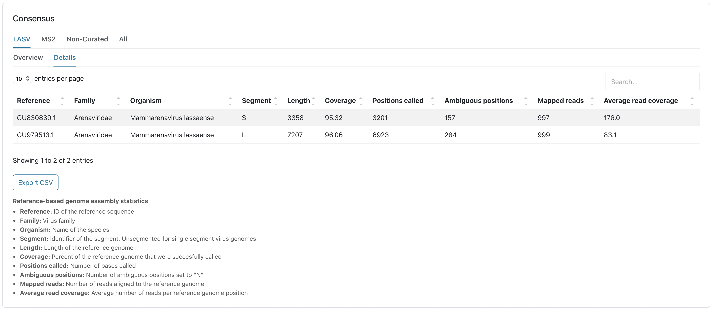
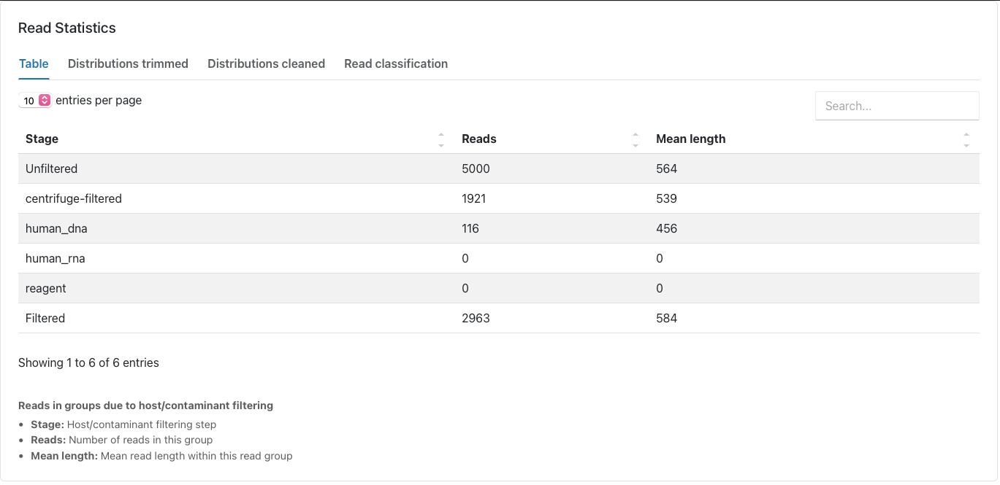
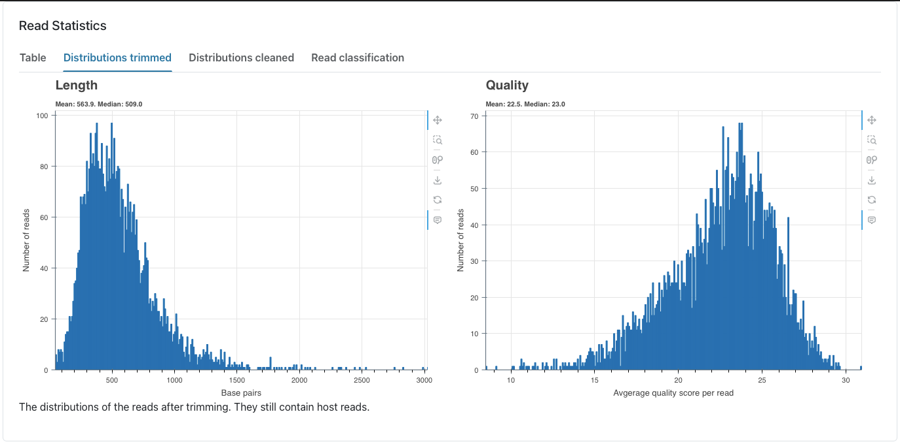
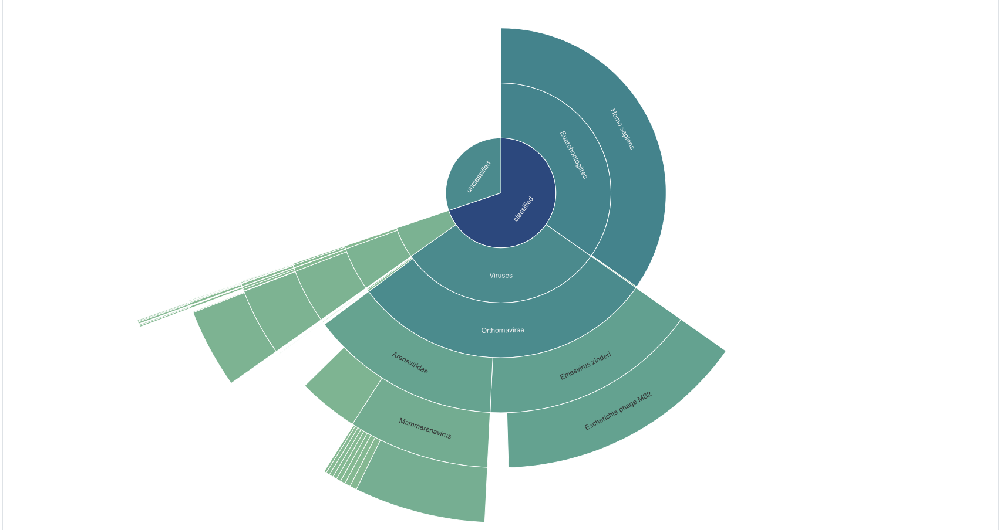
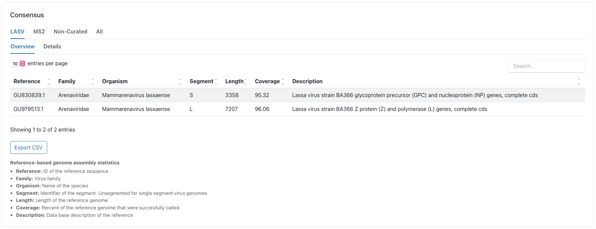
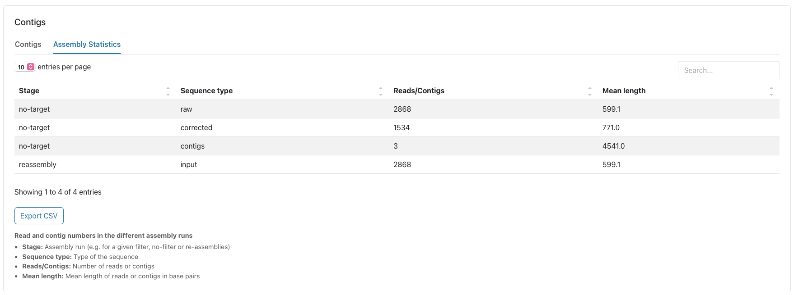

# Demo output interpretation
After completing the installation tutorial, you will end up with a [report file](https://opr.bnitm.de/example_data/report_example_data.html) and the output files. Feel free to explore our example report through the previously provided link.  
You will find this HTML-report when selecting the Reports tab in the EPI2ME interface, or in the output directory that you would have defined via the command line.  
The reports and output files will be created per barcode, and in the menu you can select the report you are interested in. In our demo we only have one barcode:  



## Read Statistics
Once you open the report, the first thing you will see are the read statistics. This includes the length distribtions before and after trimming and filtering as well as the amount of reads that were filtered out based on the centrifuge classification (see 'read classification' tab) and the mapping onto the host genome and the reagent database.  







## Consensus
This section reports the main output of the pipeline. Here the virus species and the coverage of the generated consensus sequence is reported. We have a curated subset of viruses relevant to our projects. If these viruses are found in our samples, these viruses show up in the report in a separate tab. In our demo report for example we have both LASV segments. All other viruses would show up in the Non-curated or All tab.     

  


## Contigs
In the next section you will see the assembly results provided by canu. You can also see the Blast hit of each contig that was used to create the consensus sequence. Additionally, in this report you can see the centrifuge classification of each contig. You can check if there is any discrepancies between the BLAST and centrifuge classification, since the blast search only includes viruses you can check for false positives here.  

  

Additionally, we you can see how many reads were corrected and used for assembly by canu in the "Assembly statistics" tab.



## Output files

Via the files tab, you can access the consensus sequence fasta files and all the other outputs of ViMOP.  

  

From here, you can also open the output files in your Explorer/Finder, if you go to Options->Open folder.  


The output folder structure is as follows:

```
output/
└── barcode1/
    ├── assembly/  =>  the contigs created by canu
    │   ├── no-target.contigs.fasta  
    │   └── re-assembly.contigs.fasta
    │
    ├── classification/  =>  output of centrifuge
    │   ├── classification_barcode1.tsv
    │   ├── classification_kraken_barcode1.tsv
    │   └── classification_report_barcode1.tsv
    │
    ├── consensus/ => the final and intermediate results of the
    |   |             consensus creation with minimap2 and medaka
    │   ├── <Reference1>.consensus.fasta
    │   ├── <Reference1>.depth.txt
    │   ├── <Reference1>.reads.bam
    │   ├── <Reference1>.reads.bam.bai
    │   ├── <Reference1>.reference.fasta
    │   ├── <Reference1>.structural_variants.vcf
    │   ├── <Reference2>.consensus.fasta
    │   ├── <Reference2>.depth.txt
    │   ├── <Reference2>.reads.bam
    │   ├── <Reference2>.reads.bam.bai
    │   ├── <Reference2>.reference.fasta
    │   ├── <Reference2>.structural_variants.vcf
    │   ├── <Reference3>.consensus.fasta
    │   ├── <Reference3>.depth.txt
    │   ├── <Reference3>.reads.bam
    │   ├── <Reference3>.reads.bam.bai
    │   ├── <Reference3>.reference.fasta
    │   ├── <Reference3>.structural_variants.vcf
    │   ├── <Reference4>.consensus.fasta
    │   ├── <Reference4>.depth.txt
    │   ├── <Reference4>.reads.bam
    │   ├── <Reference4>.reads.bam.bai
    │   ├── <Reference4>.reference.fasta
    │   └── <Reference4>.structural_variants.vcf
    │
    ├── report_barcode1.html
    │
    ├── selected_consensus/  =>  consensus sequences if viruses from our
    |   |                        curated dataset were found
    │   ├── LASV_L.fasta
    │   ├── LASV_S.fasta
    │   └── MS2.fasta
    │
    └── tables/  =>  The tables you can see in the report.html as tsv files
        ├── consensus.tsv
        ├── contigs.tsv
        └── reads.tsv
```


