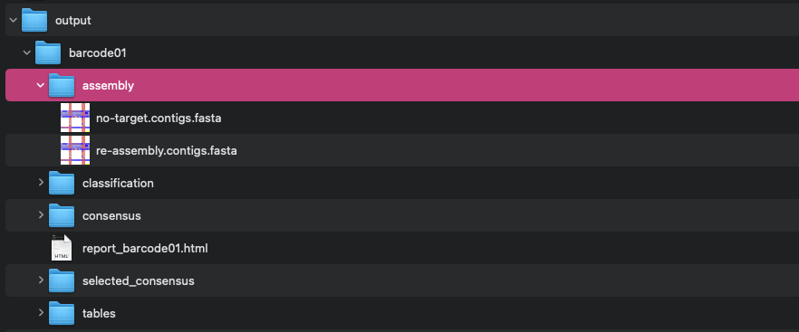

# Output interpretation
In this tutorial we will go through our demo results and learn how to interpret the output of ViMOP. We will also explain which metrics to look at to evaluate the analysis quality and possibly identify false positives in the results. For this we will go through the HTML report provided by ViMOP section by section.  

After completing the installation tutorial, you will end up with a [report file](https://opr.bnitm.de/example_data/report_example_data.html) and the output files. Feel free to explore our example report through the previously provided link.  
You will find this HTML-report when selecting the **Reports tab** in the EPI2ME interface, or in the output directory that you would have defined via the command line.  

## Read Statistics
Once you open the report, the first thing you will see are the read statistics. This includes the length distribtions before and after trimming and filtering as well as the amount of reads that were filtered out based on the centrifuge classification (see 'read classification' tab) and the mapping onto the host genome and the reagent database.  
Our demo run only contains 5000 simulated reads, a real data set would have much more reads, but the length and quality distribution would be similar since the simulator was trained on a real LASV sequencing data set.  
In this section you can check, if the mean read length of your sample was enough for a reliable consensus. ViMOP can handle mean read lengths as low as 100 bp, but more ideal would be any value >500 bp.  
In the Read classification tab we can see the metagenomic overview of our sample. If canu failed to build a contig and thus the workflow did not yield a result, you can check if there was any virus found here and restart the analysis with a custom fasta file as a reference. 

  

  

  

## Consensus
This section reports the main output of the pipeline. If ViMOP found a reference in the target detection step, the best BLAST hit per virus species would be used for consensus sequence creation. 
In this section the virus species and the coverage of these generated consensus sequences is reported.  
We have a curated subset of viruses relevant to our projects. If these viruses are found in our samples, these viruses show up in the report in a separate tab.  
In our demo report for example we have both LASV segments and the MS2 phage as a control in the sample. All other viruses would show up in the Non-curated and the All tab.  
To get an idea of how successful the consensus creation was, in the **Overview tab** you can have a look at the **Coverage**. This number indicates how much of the reference could be reconstructed from the sequencing run. This means that this percentage of the found reference could be mapped with a minimum read depth of 20X. The closer to 100 this number is, the better. If the Coverage is very low, the resulting consensus sequence may not be sufficient for phylogenetic analysis and should be used with caution.  
In the **Details** tab you will see the absolute number of **Positions called** and how many **Ambigious positions** are in the final consensus.  
A high number of mapped reads and a high average read coverage can be indicators for a reliable consensus sequence.  
If these numbers are low, this is usually an indicator that there were not enough reads in the sample. However, in some cases, it could mean that the found reference needs to be re-evaluated.

  

## Contigs
In the **Contigs section** you will see the assembly results provided by canu. You can also see the BLAST hit of each contig that was used to create the consensus sequence. Additionally, there is the centrifuge classification of each contig.  
You can also see how well each BLAST hit fits the contig. If the **Reference Alignment coverage** or **Contig alignment coverage** are very low (<0.7), this indicates that the contig is only a partial match and therefore should be questioned. Another warning sign for a wrongly classified contig would be a low sequence identity. Furthermore, if the contig length is longer than the BLAST hit, the found reference may be not the correct reference and you should re-evaluate the results. Things that could have happened are that bacterial reads do not get filtered out properly in the cleaning steps and get assembled to contigs that are then classified as phages, since the genome of the phage is also contained in the bacterial genome. Since our BLAST database does not contain bacterial genomes, the best hit would then be a phage, even though the contig may be much longer than the found reference. In these cases the first check would be to see if there is any discrepancies between the BLAST and centrifuge classification, since the centrifuge index does include bacterial sequences.

  

In the **Assembly statistics** tab, you can see how many reads were given to, corrected and then used for assembly by canu. Canu subsamples a small fraction of reads for assembly, since using all of them would take too long. The number of 1534 that we see here is what you would also see for similar runs with more reads.

## How to evaluate your results

In summary, when evaluating your analysis results you should look out for the following cases in your report:
- **Partial matches** are often indicated by:
  - short **BLAST hit length**
  - low **Reference Alignment coverage**
  - low **Contig alignment coverage**
- **Wrong Reference Selection** could have happened when you see
  - a low **Coverage** of the consensus sequence
  - low **Sequence identity** between contig and BLAST hit
  - **mismatch between centrifuge and BLAST** contig classification
  - The Contig **Length** is much shorter or longer than the BLAST **Hit Length**

In these cases you should manually review the output files of your analysis run. A first step for such a reviewing process is described in the next section.

## How to review unexpected results

### Open your output folder

If you saw any unexpected outputs as described previously, or if ViMOP failed to create a consensus sequence in general, you should:
1. Open the assembly subfolder in your output folder.  

2. Open the FASTA files in that subfolder
3. Select the contig(s) that caused your suspicion and upload its sequence to [NCBI BLASTn](https://blast.ncbi.nlm.nih.gov/Blast.cgi?PROGRAM=blastn&BLAST_SPEC=GeoBlast&PAGE_TYPE=BlastSearch) and BLAST it against the most recent BLAST database version.  
    - If this yields the same (weird) results as ViMOP or no hits at all, then the sequencing run probably did not contain enough viral material for virus detection or Canu failed to create useful contigs.
    - If this search, yields a different virus that fits more into your expectations with a high identity, then the sample contained a virus we proabably have not in our database yet.
4. You could then restart the analysis by providing the found fasta File as a custom reference. 
    - In EPI2ME that would be under Input Options->Custom reference FASTA. 
    - Via the command line you can provide a custom reference FASTA (with one or multiple references) using the --custom**ref**fasta parameter.

